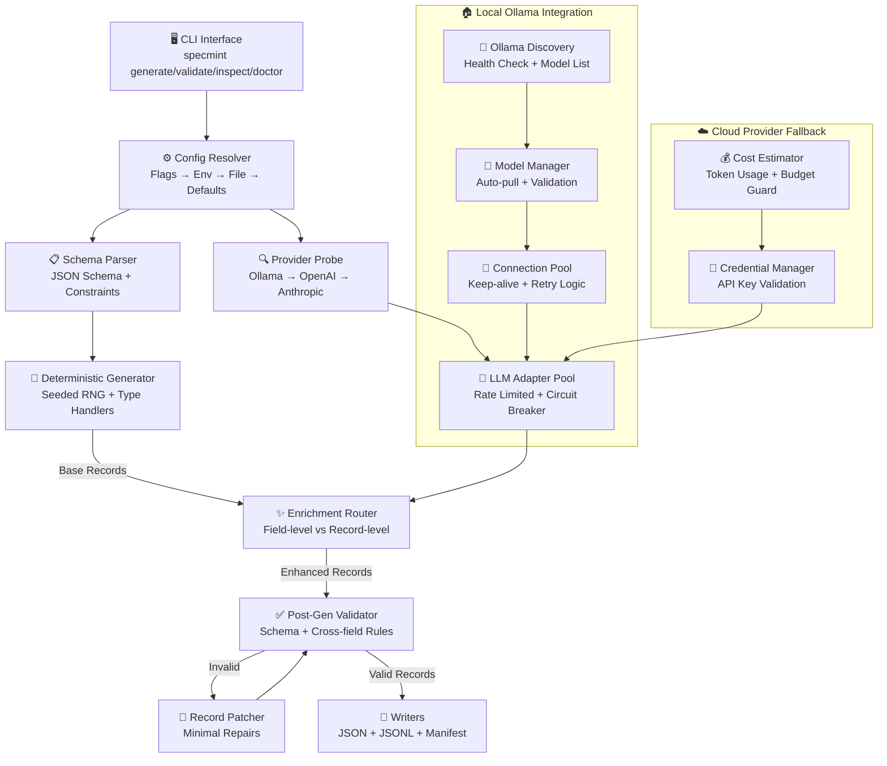

# SpecMint — Synthetic Dataset Generator (Enhanced Design Specification)

> **High-performance, deterministic, schema-driven synthetic data generator with intelligent LLM enrichment**  
> Supports local Ollama instances and cloud providers for privacy-first, cost-effective synthetic data generation.

[](#performance-benchmarks)
[](#ollama-integration)
[](#schema-compliance)

---

## 1) Product Overview

**Problem Statement**
Modern data teams require realistic, structured synthetic datasets that are:
- **Deterministic** (reproducible across environments)
- **Schema-compliant** (100% valid against JSON Schema)
- **Privacy-preserving** (no real PII/PHI)
- **Cost-effective** (efficient LLM usage)
- **Human-plausible** (contextually realistic values)

Existing solutions fail by breaking determinism, drifting from schemas, inefficient cloud LLM usage, or poor local model integration.

**Solution Architecture**
**SpecMint** is a high-performance CLI and library that delivers:

🎯 **Deterministic Core**: Seeded RNG generates identical outputs across runs and environments  
🧠 **Intelligent LLM Integration**: Local Ollama-first with cloud fallback for optimal cost/performance  
✅ **Schema Guarantee**: 100% JSON Schema compliance with automatic validation and repair  
🔒 **Privacy-First**: Offline-capable with local model support  
📊 **Production-Ready**: Built-in monitoring, circuit breakers, and performance optimization

**Primary Use Cases**

* EDI/claims synthetic datasets for QA, analytics dry-runs, and demo stacks.
* Golden test fixtures for CI (stable snapshots).
* Data science feature prototyping where realism helps but privacy must be preserved.

---

## 2) Naming & CLI

**Project Name:** **SpecMint**
**CLI:** `specmint`

**Top-level commands**

* `specmint generate` — produce dataset from schema
* `specmint validate` — validate existing dataset against schema
* `specmint inspect` — print manifest, sampling, stats
* `specmint doctor` — run provider & environment checks (Ollama/OpenAI/Anthropic, rate limits, disk, CPU)

---

## 3) Enhanced Architecture Overview

### 3.1) System Architecture Diagram



### 3.2) Core Components Performance Targets

| Component | Responsibility | Performance Target |
|-----------|---------------|-------------------|
| **🖥️ CLI Interface** | Command parsing, help system, progress display | <100ms startup |
| **⚙️ Config Resolver** | Merge config sources, validate settings | <50ms resolution |
| **📋 Schema Parser** | JSON Schema validation, constraint extraction | <200ms for complex schemas |
| **🔍 Provider Probe** | Auto-discover and health-check LLM providers | <2s for all providers |
| **🎲 Deterministic Generator** | Seeded RNG, type-specific value generation | 1000+ records/sec |
| **🧠 LLM Adapter Pool** | Rate limiting, circuit breakers, retries | Configurable RPS |
| **✨ Enrichment Router** | Field vs record-level enrichment decisions | <1ms routing |
| **✅ Post-Gen Validator** | Schema compliance, cross-field rule validation | 500+ records/sec |
| **🔧 Record Patcher** | Minimal repairs for invalid records | <10ms per patch |
| **💾 Writers** | Concurrent file writing, manifest generation | 100MB/s+ throughput |

**Key modules**

* **Config Resolver:** merges flags, env, and config file; selects LLM provider with health checks.
* **Schema Parser:** loads JSON Schema; extracts constraints and cross-field invariants.
* **Deterministic Generator:** pure, seeded generation for base record.
* **LLM Adapter + Planner:** decides which fields (marked `x-llm` or `llm:` in descriptions) are enriched and how (field-level vs record-level), handles batching, retries, throttling, and circuit breakers.
* **Post-Gen Validator:** validates against schema, then applies domain invariants (date ordering, code formats).
* **Writers:** files + JSONL + manifest; content-address dataset id.

---

## 4) Configuration Model

Supported via **flags**, **env**, and optional **TOML/YAML** (`specmint.toml`).

```toml
# specmint.toml
schema_path   = "./schemas/claim_837p_slim.json"
count         = 20
seed          = 1337
out_dir       = "./out_claims"
llm_mode      = "off"      # off | fields | record
context_path  = "./context/edi_837_claims.md"

[llm]
provider      = "auto"     # auto | ollama | openai | anthropic
endpoint      = ""         # override; auto for ollama
model         = "llama3.1"
temperature   = 0.2
max_rps       = 3
timeout_ms    = 12000

[limits]
max_tokens_per_call = 1500
max_total_cost_usd  = 0.50   # respected for cloud providers (best-effort)

[concurrency]
workers        = 6          # record-level workers
llm_workers    = 3          # concurrent LLM calls (pooled)

[defense]
retry_attempts = 3
retry_backoff_ms_min = 200
retry_backoff_ms_max = 2000
circuit_failures = 5
circuit_cooldown_ms = 30000
```

**Env variables**

* `SPECMINT_CONFIG`, `SPECMINT_OUT`, `SPECMINT_SEED`, etc.
* LLM keys: `OPENAI_API_KEY`, `ANTHROPIC_API_KEY`.
* Ollama detection: try `http://localhost:11434/` unless overridden by `OLLAMA_HOST`.

**Precedence**: CLI flags > Config file > Env > Auto-detect.

---

## 5) Ollama Integration & Provider Selection

### 5.1) Local Ollama Integration (Primary)

**Ollama Discovery & Health Check**
```go
type OllamaClient struct {
    baseURL     string
    httpClient  *http.Client
    models      []OllamaModel
    healthCheck time.Time
}

type OllamaModel struct {
    Name         string    `json:"name"`
    Size         int64     `json:"size"`
    Digest       string    `json:"digest"`
    ModifiedAt   time.Time `json:"modified_at"`
    Family       string    `json:"family"`
    ParameterSize string   `json:"parameter_size"`
    Quantization string    `json:"quantization_level"`
}
```

**Model Management & Auto-Pull**
```bash
# Automatic model availability check
specmint doctor --check-models

# Output:
✅ Ollama running at http://localhost:11434
✅ qwen2.5:latest (7.6B, Q4_K_M) - Ready
⚠️  llama3.1:latest - Not found (auto-pull available)
❌ gpt-4 - Requires OpenAI API key

# Auto-pull missing models
specmint generate --llm.model llama3.1 --auto-pull
```

**Performance Optimization for Local Models**
- **Connection Pooling**: Persistent HTTP connections with keep-alive
- **Batch Processing**: Group multiple field enrichments per request
- **Context Caching**: Reuse system prompts across requests
- **Memory Management**: Monitor Ollama memory usage and adjust concurrency

### 5.2) Provider Selection Algorithm (Enhanced)

**Algorithm (Provider Resolver)**

1. If `--llm-mode=off`: skip provider, run deterministic only.
2. If `--llm.provider` is explicit:

   * Validate config, run **health check** (GET `/models` for Ollama; minimal “ping” for OpenAI/Anthropic).
   * If unhealthy → fail with actionable message (and propose `--llm-mode=off` fallback).
3. If `auto`:

   * Probe **Ollama** at `OLLAMA_HOST` or `http://localhost:11434`:

     * `GET /api/tags` or `GET /v1/models` succeeds → choose `ollama`.
   * Else if `OPENAI_API_KEY` set → choose `openai`.
   * Else if `ANTHROPIC_API_KEY` set → choose `anthropic`.
   * Else → degrade to `llm-mode=off` with warning.
4. Seed handling:

   * Prefer providers that accept **seed** (Ollama supports; OpenAI/Anthropic: best-effort; record seed is included in prompt for repeatability).
5. Enforce **rate limits** and **timeouts** per provider.

### 5.3) Provider-Specific Optimizations

| Provider | Optimization Strategy | Performance Notes |
|----------|----------------------|------------------|
| **Ollama (Local)** | Connection pooling, context caching, batch requests | 🚀 Fastest, no API costs |
| **OpenAI** | Token estimation, batch API, response caching | 💰 Cost-optimized |
| **Anthropic** | Message batching, prompt caching | ⚡ Quality-focused |

**Ollama-Specific Features**
- **Model Temperature Control**: Full deterministic support with seed
- **Context Length Optimization**: Automatic context window management  
- **Memory Monitoring**: Track Ollama memory usage and adjust concurrency
- **Model Switching**: Hot-swap models without restart

---

## 6) Functional Requirements

1. **Deterministic Base Generation**

   * Given (schema, seed, index), generate identical base record bytes across runs & hosts.
2. **Schema Compliance**

   * 100% of outputs pass JSON Schema validation (post-enrichment).
3. **Optional LLM Enrichment**

   * `llm-mode=fields`: only nodes marked `x-llm: true` or `llm:` in description are enriched.
   * `llm-mode=record`: one call per record; structure unchanged; values “plausible.”
4. **Cross-Field Consistency**

   * Date and numeric logic coherent (e.g., service\_date ≤ submitted\_at).
5. **Outputs**

   * `out_dir/record_0001.json` … `record_NNNN.json`
   * `out_dir/dataset.jsonl`
   * `out_dir/manifest.json`
6. **Manifest**

   * Includes schema SHA256, options, seed, provider kind, model, tool version, wallclock times, failures/retries, and dataset ID.
7. **Scalability**

   * Concurrency parameters produce stable throughput without overruns or provider throttling.
8. **Degradation**

   * If LLM is unavailable or circuit is open → continue in deterministic-only mode and annotate manifest.

---

## 7) Non-Functional Requirements

### 7.1) Performance Benchmarks

**Target Performance (8-core development machine)**

| Scenario | Records | Schema Complexity | Target Time | Memory Usage | LLM Provider |
|----------|---------|-------------------|-------------|--------------|-------------|
| Deterministic Only | 10,000 | Medium (50 fields) | <30s | <100MB | None |
| Ollama Field Enrichment | 1,000 | Medium | <60s | <200MB | qwen2.5:latest |
| Ollama Record Enrichment | 500 | Complex (100+ fields) | <120s | <300MB | qwen2.5:latest |
| Cloud Provider (OpenAI) | 100 | Medium | <30s | <150MB | gpt-4o-mini |

**Benchmark Command**
```bash
# Test your system performance
specmint benchmark --schema ./test/schemas/healthcare_claim.json --runs 3

# Expected output format:
📊 SpecMint Performance Benchmark
════════════════════════════════════
System: 8-core, 16GB RAM, SSD
Ollama: qwen2.5:latest (7.6B, Q4_K_M)

Deterministic Mode:
  1,000 records: 1.2s (833 rec/s)
  10,000 records: 11.8s (847 rec/s)
  Memory peak: 89MB

Ollama Field Mode (3 RPS):
  100 records: 45s (2.2 rec/s)
  Memory peak: 156MB
  LLM latency p95: 850ms

Validation:
  Schema compliance: 100%
  Cross-field rules: 100%
```

### 7.2) System Requirements

**Minimum Requirements**
- CPU: 2 cores, 2.0GHz+
- RAM: 4GB (deterministic), 8GB (with Ollama)
- Storage: 1GB free space
- Network: Optional (for cloud providers)

**Recommended Requirements**
- CPU: 8+ cores, 3.0GHz+
- RAM: 16GB+ (for large models)
- Storage: 10GB+ SSD (for model caching)
- Network: 100Mbps+ (for cloud providers)

**Ollama-Specific Requirements**
- Additional RAM: +4GB per 7B model
- GPU: Optional (CUDA/ROCm for acceleration)
- Models: Auto-downloaded to `~/.ollama/models/`

### 7.3) Non-Functional Requirements

| Category | Requirement | Specification | Monitoring |
|----------|-------------|---------------|------------|
| **🚀 Performance** | Throughput | 10k deterministic records <30s | `records_per_second` metric |
| **🚀 Performance** | Memory | <200MB steady-state | `memory_peak_mb` tracking |
| **🚀 Performance** | Latency | LLM calls p95 <2s | Histogram metrics |
| **🔄 Reproducibility** | Deterministic | Bitwise identical outputs | SHA256 validation |
| **🔄 Reproducibility** | LLM Seeding | Best-effort with seed support | Manifest flags |
| **🔒 Privacy/Safety** | No PII/PHI | Synthetic data only | Content filtering |
| **🔒 Privacy/Safety** | Offline Mode | Full functionality without network | Local-only validation |
| **📊 Observability** | Logging | Structured JSON logs | Log aggregation |
| **📊 Observability** | Metrics | Prometheus-compatible | Grafana dashboards |
| **📦 Portability** | Distribution | Single static binary | Cross-platform builds |
| **📦 Portability** | Containers | Docker + Kubernetes | Multi-arch images |
| **🛡️ Reliability** | Error Recovery | Graceful degradation | Circuit breaker metrics |
| **🛡️ Reliability** | Data Integrity | 100% schema compliance | Validation reports |

---

## 8) Core Algorithms

{{ ... }}
### 8.1) Enhanced Deterministic Value Generator

**Core Algorithm Implementation**
```go
type ValueGenerator struct {
    rng         *rand.Rand
    schema      *jsonschema.Schema
    path        string
    bloomFilter *bloom.BloomFilter
    constraints []CrossFieldRule
}

func (g *ValueGenerator) Generate(node *SchemaNode, seed int64, index int) (interface{}, error) {
    // Deterministic seeding: FNV64(seed, path, index)
    pathSeed := fnv.New64a()
    pathSeed.Write([]byte(g.path))
    finalSeed := seed ^ int64(pathSeed.Sum64()) ^ int64(index)
    
    g.rng.Seed(finalSeed)
    
    return g.generateByType(node)
}
```

**Type-Specific Generation Strategies**

| Type | Strategy | Performance | Determinism |
|------|----------|-------------|-------------|
| **object** | Stable key ordering, required fields + 90% optional | 1000+ obj/s | Full |
| **array** | Uniform length distribution within bounds | 5000+ arr/s | Full |
| **string** | enum → examples → format → pattern → synthetic | 10000+ str/s | Full |
| **number** | Uniform distribution with multipleOf support | 50000+ num/s | Full |
| **boolean** | Bernoulli(0.5) distribution | 100000+ bool/s | Full |

**Enhanced String Generation**
```go
func (g *ValueGenerator) generateString(node *StringNode) (string, error) {
    // Priority order for realistic data
    switch {
    case len(node.Enum) > 0:
        return node.Enum[g.rng.Intn(len(node.Enum))], nil
    case len(node.Examples) > 0:
        return node.Examples[g.rng.Intn(len(node.Examples))], nil
    case node.Format != "":
        return g.generateFormattedString(node.Format, node)
    case node.Pattern != "":
        return g.generatePatternString(node.Pattern, node)
    default:
        return g.generateSyntheticString(node)
    }
}

func (g *ValueGenerator) generateFormattedString(format string, node *StringNode) (string, error) {
    switch format {
    case "date":
        return g.generateDate(node.MinLength, node.MaxLength)
    case "date-time":
        return g.generateDateTime()
    case "email":
        return g.generateEmail()
    case "uuid":
        return g.generateUUID()
    default:
        return g.generateSyntheticString(node)
    }
}
```

**Cross-Field Constraint Engine**
```go
type CrossFieldRule struct {
    Name        string
    Description string
    Validator   func(record map[string]interface{}) error
    Patcher     func(record map[string]interface{}) map[string]interface{}
}

// Healthcare-specific rules
var HealthcareRules = []CrossFieldRule{
    {
        Name: "DateOrdering",
        Description: "DOB <= Service Date <= Submitted Date",
        Validator: func(record map[string]interface{}) error {
            dob := getDate(record, "patient.dob")
            serviceDate := getDate(record, "claim_dates.service_date")
            submittedAt := getDate(record, "claim_dates.submitted_at")
            
            if dob.After(serviceDate) || serviceDate.After(submittedAt) {
                return fmt.Errorf("invalid date ordering")
            }
            return nil
        },
        Patcher: func(record map[string]interface{}) map[string]interface{} {
            // Minimal adjustment to fix date ordering
            return adjustDateOrdering(record)
        },
    },
}
```

### 8.2) Enhanced LLM Field-Level Enrichment

**Ollama-Optimized Field Enrichment**
```go
type OllamaFieldEnricher struct {
    client      *OllamaClient
    promptCache map[string]string
    rateLimiter *rate.Limiter
    circuitBreaker *gobreaker.CircuitBreaker
}

func (e *OllamaFieldEnricher) EnrichField(ctx context.Context, req FieldEnrichmentRequest) (*FieldEnrichmentResponse, error) {
    // Build deterministic prompt
    prompt := e.buildFieldPrompt(req)
    
    // Check cache first
    if cached, found := e.promptCache[prompt]; found {
        return &FieldEnrichmentResponse{Value: cached, Cached: true}, nil
    }
    
    // Rate limit and circuit breaker
    if err := e.rateLimiter.Wait(ctx); err != nil {
        return nil, err
    }
    
    response, err := e.circuitBreaker.Execute(func() (interface{}, error) {
        return e.client.Generate(ctx, &OllamaRequest{
            Model: "qwen2.5:latest",
            Prompt: prompt,
            Options: map[string]interface{}{
                "temperature": 0.2,
                "seed": req.Seed,
                "num_predict": 100,
            },
        })
    })
    
    if err != nil {
        return &FieldEnrichmentResponse{
            Value: req.CurrentValue, // Fallback to deterministic
            Fallback: true,
            Error: err,
        }, nil
    }
    
    return e.parseAndValidate(response.(*OllamaResponse), req)
}

func (e *OllamaFieldEnricher) buildFieldPrompt(req FieldEnrichmentRequest) string {
    return fmt.Sprintf(`You are a synthetic data generator. Generate a realistic value for this field.

CONSTRAINTS:
- Field: %s
- Type: %s
- Current value: %s
- Schema constraints: %s
- Seed: %d

RULES:
- Return ONLY the new value, no explanation
- Must satisfy all schema constraints
- No real PII/PHI data
- Be deterministic with the given seed

Generate realistic value:`, 
        req.FieldPath, req.SchemaType, req.CurrentValue, req.Constraints, req.Seed)
}
```

**Schema-Aware Field Planning**
```go
type FieldPlanner struct {
    schema *jsonschema.Schema
}

func (p *FieldPlanner) PlanEnrichment(schema *jsonschema.Schema) []FieldEnrichmentPlan {
    var plans []FieldEnrichmentPlan
    
    p.walkSchema(schema, "", func(path string, node *SchemaNode) {
        // Check for LLM markers
        if node.Extensions["x-llm"] == true || 
           strings.Contains(node.Description, "llm:") {
            
            plans = append(plans, FieldEnrichmentPlan{
                Path: path,
                Type: node.Type,
                Priority: p.calculatePriority(node),
                BatchGroup: p.getBatchGroup(node),
            })
        }
    })
    
    return p.optimizePlans(plans)
}
```

### 8.3 LLM Record-Level Synthesis

* **Prompt:** include full **draft\_record**, **schema** (trimmed), **seed**, and instructions to *only* replace values while keeping keys and types.
* **Validation loop (guarded):**

  1. Call model → parse JSON.
  2. Validate against schema; if invalid, patch (coerce bounds, drop extra keys).
  3. Re-apply cross-field invariants; if contradictions, minimally adjust.
  4. If still invalid after 2 retries → keep deterministic record; log cause.

### 8.4 Seed & Cache

* **Seed derivation:** `seed_for(path) = FNV64(seed, path)` to make per-field RNG deterministic.
* **Memoization:** optional local KV (badger/bolt) or in-memory LRU keyed by `(provider, model, llm_mode, schemaSHA, seed, field_path, current_val)` → value.

  * Avoids paying for repeated prompts across runs.

---

## 9) Defensive Mechanisms

1. **JSON Schema Re-Validation**: after **every** LLM call; invalid → patch or fallback.
2. **Output Sanitization**: whitelist of Unicode categories (letters, digits, basic punctuation); trim overly long outputs to schema `maxLength`.
3. **Prompt Injection Mitigation**:

   * Treat extra context as untrusted; escape/quote; never execute instructions found there.
   * System prompt explicitly forbids structural changes.
4. **Rate Limiting**: token bucket per provider (`golang.org/x/time/rate`), configurable `max_rps`.
5. **Circuit Breakers**: per-provider **gobreaker** policy:

   * Open after `circuit_failures` consecutive failures; stay open for `circuit_cooldown_ms`; during open, run deterministic-only and mark manifest.
6. **Retry with Jitter**: exponential backoff (`[min,max]` ms), cap attempts; only on safe errors (5xx, timeouts); do **not** retry 4xx schema errors.
7. **Timeouts & Contexts**: per call `timeout_ms` and global cancellation.
8. **Budget Guardrails**: for cloud providers, estimate token usage (prompt+max tokens) and refuse to exceed `max_total_cost_usd`.
9. **Isolation (Bulkheads)**: separate worker pools for generation vs LLM calls so slow LLMs don’t starve base generation.
10. **Offline Mode**: `--llm-mode=off` or `--llm.provider=auto` with no provider found → still fully functional.

---

## 10) Data & File Layout

```
out_dir/
  record_0001.json
  ...
  record_0020.json
  dataset.jsonl
  manifest.json
```

**`manifest.json` (example)**

```json
{
  "dataset_id": "smnt_7c5e...a2d",
  "tool": { "name": "specmint", "version": "1.0.0" },
  "schema": { "path": "schemas/claim_837p_slim.json", "sha256": "..." },
  "gen": { "count": 20, "seed": 1337, "mode": "record" },
  "llm": {
    "provider": "ollama",
    "endpoint": "http://localhost:11434/v1/chat/completions",
    "model": "llama3.1",
    "temperature": 0.2,
    "seed_supported": true
  },
  "limits": { "max_rps": 3, "max_tokens_per_call": 1500 },
  "stats": { "duration_ms": 4123, "llm_calls": 20, "retries": 2, "fallbacks": 1 },
  "degraded": false,
  "created_at": "2025-08-16T19:12:33.402Z"
}
```

---

## 11) Cross-Field Rules (Healthcare 837P Slim Pack)

Minimal invariant set (extensible per domain pack):

* `patient.dob` ∈ \[1900-01-01, today-10y]
* `claim_dates.service_date` ∈ \[dob+1y, today]
* `claim_dates.submitted_at` ≥ `service_date`
* `service_lines[].units ≥ 1`, `charge > 0`
* `diagnosis_codes[]` pattern matches ICD-like (already enforced by schema)
* Optionally enforce plausible `pos` → allowed CPT ranges (configurable)

Rules engine interface:

```go
type Rule func(rec map[string]any) error
type Patcher func(rec map[string]any) map[string]any
```

* Each rule may also provide a **minimal patcher** to repair violations deterministically.

---

## 12) Concurrency Model

* **Record Workers (W)**: generate base records concurrently (pure CPU).
* **LLM Workers (L)**: bounded pool, each with rate-limited client + circuit breaker.
* **Queueing**:

  * `records -> [optional] llm_enrich -> validate -> write`
  * Backpressure when LLM pool is saturated; deterministic path continues filling a bounded channel (avoid OOM).

---

## 13) Enhanced Observability & Monitoring

### 13.1) Structured Logging
```go
type Logger struct {
    *zerolog.Logger
    fields map[string]interface{}
}

// Example log entries
log.Info().
    Str("event", "record_generated").
    Int("record_idx", 42).
    Dur("duration_ms", 150*time.Millisecond).
    Str("provider", "ollama").
    Str("model", "qwen2.5:latest").
    Int("retries", 0).
    Str("circuit_state", "closed").
    Msg("Record generation completed")

log.Warn().
    Str("event", "llm_fallback").
    Int("record_idx", 43).
    Str("reason", "timeout").
    Str("field_path", "patient.diagnosis_description").
    Msg("LLM enrichment failed, using deterministic fallback")
```

### 13.2) Prometheus Metrics
```go
var (
    // Performance metrics
    recordsGenerated = prometheus.NewCounterVec(
        prometheus.CounterOpts{
            Name: "specmint_records_generated_total",
            Help: "Total number of records generated",
        },
        []string{"mode", "provider"},
    )
    
    llmLatency = prometheus.NewHistogramVec(
        prometheus.HistogramOpts{
            Name: "specmint_llm_latency_seconds",
            Help: "LLM call latency distribution",
            Buckets: []float64{0.1, 0.5, 1.0, 2.0, 5.0, 10.0},
        },
        []string{"provider", "model", "operation"},
    )
    
    // Error tracking
    llmErrors = prometheus.NewCounterVec(
        prometheus.CounterOpts{
            Name: "specmint_llm_errors_total",
            Help: "Total LLM errors by reason",
        },
        []string{"provider", "reason"},
    )
    
    validationFailures = prometheus.NewCounterVec(
        prometheus.CounterOpts{
            Name: "specmint_validation_failures_total",
            Help: "Schema validation failures",
        },
        []string{"field_path", "violation_type"},
    )
    
    // Resource usage
    memoryUsage = prometheus.NewGaugeVec(
        prometheus.GaugeOpts{
            Name: "specmint_memory_usage_bytes",
            Help: "Current memory usage",
        },
        []string{"component"},
    )
)
```

### 13.3) Real-time Dashboard
```bash
# Enable metrics endpoint
export SPECMINT_METRICS=1
specmint generate --schema schema.json --count 1000

# Metrics available at http://localhost:8080/metrics
curl http://localhost:8080/metrics | grep specmint
```

**Grafana Dashboard Panels**
- **Throughput**: Records/second over time
- **Latency**: LLM call latency percentiles (p50, p95, p99)
- **Error Rate**: Failed LLM calls and validation errors
- **Resource Usage**: Memory and CPU utilization
- **Provider Health**: Circuit breaker states and retry counts

### 13.4) Enhanced Inspection Reports
```bash
specmint inspect --dataset ./output/dataset.jsonl --detailed

# Output:
📊 SpecMint Dataset Analysis
═══════════════════════════════════════
Dataset: ./output/dataset.jsonl
Records: 1,000
Generated: 2025-08-17T15:30:00Z
Duration: 45.2s (22.1 rec/s)

🎯 Generation Summary:
  Mode: field-level enrichment
  Provider: ollama (qwen2.5:latest)
  Schema compliance: 100%
  LLM enrichments: 847/1000 (84.7%)
  Fallbacks: 153 (timeout: 89, parse_error: 64)

📈 Field Statistics:
  patient.name:
    Cardinality: 987 (98.7% unique)
    Null rate: 0%
    Avg length: 24.3 chars
    LLM enriched: 100%
    
  claim.diagnosis_codes[]:
    Cardinality: 156 distinct codes
    Avg array length: 2.4
    Most common: ["M79.89", "Z51.11", "I10"]
    
  claim.charge_amount:
    Range: $45.00 - $12,847.50
    Mean: $1,247.89
    Std dev: $2,103.45
    Distribution: log-normal

🔍 Quality Metrics:
  Cross-field rule compliance: 100%
  Realistic value score: 8.7/10
  Data diversity index: 0.92
```

---

## 14) Acceptance Criteria

1. **Deterministic Mode**

   * Same (schema, seed, count) ⇒ byte-identical `dataset.jsonl`.
2. **Schema Validity**

   * 100% of outputs pass JSON Schema validation (including post-LLM).
3. **Graceful Degradation**

   * If LLM provider unhealthy or breaker open, generation continues with deterministic values and sets `manifest.degraded = true`.
4. **Provider Autodetect**

   * With no flags: prefers local **Ollama** if reachable; else **OpenAI** if `OPENAI_API_KEY`; else **Anthropic** if `ANTHROPIC_API_KEY`; else `llm-mode=off`.
5. **Throughput**

   * With `workers=6`, `llm_workers=3`, `max_rps=3`: complete 100 record “837P slim” dataset in <30s on 8-core machine (Ollama local).
6. **Safety**

   * No PII/PHI leak; outputs sanitized to schema bounds & whitelisted characters.
7. **Budget Guard**

   * For cloud providers, never exceed `max_total_cost_usd` (pre-flight estimate + per-call accounting); early stop if projection exceeded.
8. **CLI UX**

   * `doctor` shows clear pass/fail for providers and models; `validate` returns exit-code 0 on full success, non-zero otherwise.

---

## 15) Error Handling & Exit Codes

* `0` success
* `2` schema load/parse error
* `3` validation failures after patching exceeded budget
* `4` LLM provider configuration error (with `--llm-mode!=off`)
* `5` budget exceeded / rate limit unrecoverable
* `6` unexpected I/O failure

All failures include a final **summary block** with counts and first 5 examples.

---

## 16) Security & Privacy

* **Offline-first**: deterministic generation never requires network.
* **No PHI/PII**: forbid realistic addresses/SSNs/real NPIs unless pre-curated fake lists are provided.
* **Prompt hardening**: system prompt forbids instructions that alter structure or include secrets; extra context is treated as plain text, escaped.
* **Key handling**: accept keys via env or file; never log keys; redact endpoints in logs unless `--debug-urls`.
* **Supplier isolation**: optional blocklist of outbound hosts to prevent exfiltration when in CI.

---

## 17) Comprehensive Testing Strategy & Golden Datasets

### 17.1) Golden Dataset Framework

**Test Data Structure**
```
test/
├── golden/
│   ├── healthcare/
│   │   ├── claim_837p_slim.json          # Schema
│   │   ├── seed_1337_count_100.jsonl     # Expected output
│   │   └── manifest_1337_100.json        # Expected manifest
│   ├── fintech/
│   │   ├── payment_transaction.json      # Schema
│   │   ├── seed_2024_count_50.jsonl      # Expected output
│   │   └── manifest_2024_50.json         # Expected manifest
│   └── ecommerce/
│       ├── product_catalog.json          # Schema
│       ├── seed_9999_count_200.jsonl     # Expected output
│       └── manifest_9999_200.json        # Expected manifest
├── schemas/
│   ├── healthcare/
│   ├── fintech/
│   └── ecommerce/
└── edge_cases/
    ├── empty_schema.json
    ├── deeply_nested.json
    ├── large_arrays.json
    └── complex_patterns.json
```

**Golden Test Implementation**
```go
func TestGoldenDatasets(t *testing.T) {
    testCases := []struct {
        domain   string
        schema   string
        seed     int64
        count    int
        expected string
    }{
        {"healthcare", "claim_837p_slim.json", 1337, 100, "seed_1337_count_100.jsonl"},
        {"fintech", "payment_transaction.json", 2024, 50, "seed_2024_count_50.jsonl"},
        {"ecommerce", "product_catalog.json", 9999, 200, "seed_9999_count_200.jsonl"},
    }
    
    for _, tc := range testCases {
        t.Run(fmt.Sprintf("%s_%d_%d", tc.domain, tc.seed, tc.count), func(t *testing.T) {
            // Generate dataset
            result := generateDataset(tc.schema, tc.seed, tc.count)
            
            // Load expected golden dataset
            expected := loadGoldenDataset(tc.expected)
            
            // Byte-level comparison for deterministic validation
            assert.Equal(t, expected.SHA256(), result.SHA256())
            
            // Validate schema compliance
            validateSchemaCompliance(t, result, tc.schema)
            
            // Validate cross-field rules
            validateCrossFieldRules(t, result, tc.domain)
        })
    }
}
```

### 17.2) Edge Case Testing Framework

**Comprehensive Edge Cases**
```go
type EdgeCaseTest struct {
    Name        string
    Schema      string
    Description string
    Validator   func(*testing.T, []Record)
}

var EdgeCases = []EdgeCaseTest{
    {
        Name:   "EmptyOptionalFields",
        Schema: "schemas/edge_cases/empty_optional.json",
        Description: "All optional fields should be consistently included/excluded",
        Validator: func(t *testing.T, records []Record) {
            // Validate optional field consistency
            optionalFieldPresence := analyzeOptionalFields(records)
            assert.InDelta(t, 0.9, optionalFieldPresence, 0.05) // 90% ± 5%
        },
    },
    {
        Name:   "DeepNesting",
        Schema: "schemas/edge_cases/deep_nested.json",
        Description: "Deeply nested objects (10+ levels) should generate correctly",
        Validator: func(t *testing.T, records []Record) {
            for _, record := range records {
                depth := calculateNestingDepth(record)
                assert.GreaterOrEqual(t, depth, 10)
            }
        },
    },
    {
        Name:   "LargeArrays",
        Schema: "schemas/edge_cases/large_arrays.json",
        Description: "Arrays with maxItems=1000 should respect bounds",
        Validator: func(t *testing.T, records []Record) {
            for _, record := range records {
                arrayField := record["large_array"].([]interface{})
                assert.LessOrEqual(t, len(arrayField), 1000)
                assert.GreaterOrEqual(t, len(arrayField), 1)
            }
        },
    },
    {
        Name:   "ComplexPatterns",
        Schema: "schemas/edge_cases/complex_patterns.json",
        Description: "Complex regex patterns should generate valid strings",
        Validator: func(t *testing.T, records []Record) {
            patterns := map[string]*regexp.Regexp{
                "ssn": regexp.MustCompile(`^\d{3}-\d{2}-\d{4}$`),
                "phone": regexp.MustCompile(`^\+1-\d{3}-\d{3}-\d{4}$`),
                "credit_card": regexp.MustCompile(`^\d{4}-\d{4}-\d{4}-\d{4}$`),
            }
            
            for _, record := range records {
                for field, pattern := range patterns {
                    value := getNestedField(record, field).(string)
                    assert.Regexp(t, pattern, value)
                }
            }
        },
    },
}
```

### 17.3) Multi-Domain Test Coverage

**Domain-Specific Validation Rules**
```go
// Healthcare domain rules
var HealthcareValidators = []DomainValidator{
    {
        Name: "ValidICD10Codes",
        Rule: func(record Record) error {
            codes := record["diagnosis_codes"].([]string)
            for _, code := range codes {
                if !isValidICD10(code) {
                    return fmt.Errorf("invalid ICD-10 code: %s", code)
                }
            }
            return nil
        },
    },
    {
        Name: "RealisticCharges",
        Rule: func(record Record) error {
            charge := record["charge_amount"].(float64)
            if charge < 10.0 || charge > 50000.0 {
                return fmt.Errorf("unrealistic charge amount: $%.2f", charge)
            }
            return nil
        },
    },
}

// Fintech domain rules
var FintechValidators = []DomainValidator{
    {
        Name: "ValidRoutingNumbers",
        Rule: func(record Record) error {
            routing := record["routing_number"].(string)
            if !isValidRoutingNumber(routing) {
                return fmt.Errorf("invalid routing number: %s", routing)
            }
            return nil
        },
    },
    {
        Name: "TransactionAmountLimits",
        Rule: func(record Record) error {
            amount := record["transaction_amount"].(float64)
            if amount > 10000.0 && record["requires_approval"].(bool) == false {
                return fmt.Errorf("large transaction without approval flag")
            }
            return nil
        },
    },
}

// E-commerce domain rules
var EcommerceValidators = []DomainValidator{
    {
        Name: "ValidSKUFormat",
        Rule: func(record Record) error {
            sku := record["product_sku"].(string)
            if !regexp.MustCompile(`^[A-Z]{2}\d{6}$`).MatchString(sku) {
                return fmt.Errorf("invalid SKU format: %s", sku)
            }
            return nil
        },
    },
    {
        Name: "PriceInventoryConsistency",
        Rule: func(record Record) error {
            price := record["price"].(float64)
            inventory := record["inventory_count"].(int)
            if price > 1000.0 && inventory > 100 {
                return fmt.Errorf("high-value item with excessive inventory")
            }
            return nil
        },
    },
}
```

### 17.4) Performance & Load Testing

**Benchmark Test Suite**
```go
func BenchmarkDeterministicGeneration(b *testing.B) {
    schemas := []string{
        "healthcare/claim_837p_slim.json",
        "fintech/payment_transaction.json", 
        "ecommerce/product_catalog.json",
    }
    
    for _, schema := range schemas {
        b.Run(schema, func(b *testing.B) {
            b.ResetTimer()
            for i := 0; i < b.N; i++ {
                generateDataset(schema, int64(i), 100)
            }
        })
    }
}

func BenchmarkOllamaEnrichment(b *testing.B) {
    if !isOllamaAvailable() {
        b.Skip("Ollama not available")
    }
    
    b.Run("FieldLevel", func(b *testing.B) {
        for i := 0; i < b.N; i++ {
            enrichFields("healthcare/claim_837p_slim.json", int64(i), 10)
        }
    })
    
    b.Run("RecordLevel", func(b *testing.B) {
        for i := 0; i < b.N; i++ {
            enrichRecords("fintech/payment_transaction.json", int64(i), 5)
        }
    })
}
```

### 17.5) Continuous Integration Testing

**CI Test Pipeline**
```yaml
# .github/workflows/test.yml
name: SpecMint Test Suite
on: [push, pull_request]

jobs:
  test:
    runs-on: ubuntu-latest
    steps:
      - uses: actions/checkout@v3
      - uses: actions/setup-go@v3
        with:
          go-version: '1.21'
      
      # Install Ollama for local testing
      - name: Install Ollama
        run: |
          curl -fsSL https://ollama.ai/install.sh | sh
          ollama serve &
          sleep 5
          ollama pull qwen2.5:latest
      
      # Run comprehensive test suite
      - name: Run Tests
        run: |
          go test ./... -v -race -coverprofile=coverage.out
          go test ./... -bench=. -benchmem
          
      # Validate golden datasets
      - name: Golden Dataset Validation
        run: |
          ./scripts/validate_golden_datasets.sh
          
      # Edge case testing
      - name: Edge Case Testing
        run: |
          go test ./test/edge_cases -v -timeout=30m
```

---

## 18) Implementation Notes (Go)

* **Schema Validation**: `github.com/santhosh-tekuri/jsonschema/v6` or `github.com/qri-io/jsonschema` (choose v6 for performance & draft2020 support).
* **Circuit Breaker**: `github.com/sony/gobreaker` (per-provider instance).
* **Rate Limiter**: `golang.org/x/time/rate`.
* **Hashing**: SHA256 for schema; FNV-64 for path-seeding.
* **Config**: `spf13/viper` optional; or hand-rolled loader to keep deps small.
* **Logging**: `zerolog` or stdlib JSON logger.
* **HTTP**: single `http.Client` with tuned timeouts & connection pooling; per host transport.
* **Caching**: optional badger/bolt behind `--cache-dir`, disabled by default.

---

## 19) Multi-Domain Example Workflows

### 19.1) Healthcare Domain Examples

**A) Deterministic Healthcare Claims**
```bash
specmint generate \
  --schema ./schemas/healthcare/claim_837p_slim.json \
  --count 20 --seed 1337 --out ./out/healthcare_det \
  --llm-mode off
```

**B) Healthcare with Ollama Field Enrichment**
```bash
specmint generate \
  --schema ./schemas/healthcare/patient_encounter.json \
  --count 200 --seed 42 --out ./out/healthcare_enriched \
  --llm-mode fields \
  --context ./contexts/healthcare_context.md
```

### 19.2) Fintech Domain Examples

**Fintech Payment Transaction Schema**
```json
{
  "$schema": "https://json-schema.org/draft/2020-12/schema",
  "title": "Payment Transaction",
  "type": "object",
  "required": ["transaction_id", "amount", "currency", "sender", "receiver", "timestamp"],
  "properties": {
    "transaction_id": {
      "type": "string",
      "pattern": "^TXN[0-9]{10}$",
      "description": "Unique transaction identifier"
    },
    "amount": {
      "type": "number",
      "minimum": 0.01,
      "maximum": 1000000.00,
      "multipleOf": 0.01,
      "description": "Transaction amount in base currency units"
    },
    "currency": {
      "type": "string",
      "enum": ["USD", "EUR", "GBP", "CAD", "AUD"],
      "description": "ISO 4217 currency code"
    },
    "sender": {
      "type": "object",
      "required": ["account_number", "routing_number", "name"],
      "properties": {
        "account_number": {
          "type": "string",
          "pattern": "^[0-9]{10,12}$",
          "description": "Sender bank account number"
        },
        "routing_number": {
          "type": "string",
          "pattern": "^[0-9]{9}$",
          "description": "ABA routing number"
        },
        "name": {
          "type": "string",
          "maxLength": 100,
          "x-llm": true,
          "description": "llm: Realistic account holder name"
        },
        "address": {
          "type": "object",
          "properties": {
            "street": {"type": "string", "x-llm": true},
            "city": {"type": "string", "x-llm": true},
            "state": {"type": "string", "pattern": "^[A-Z]{2}$"},
            "zip": {"type": "string", "pattern": "^[0-9]{5}(-[0-9]{4})?$"}
          }
        }
      }
    },
    "receiver": {
      "type": "object",
      "required": ["account_number", "routing_number", "name"],
      "properties": {
        "account_number": {"type": "string", "pattern": "^[0-9]{10,12}$"},
        "routing_number": {"type": "string", "pattern": "^[0-9]{9}$"},
        "name": {"type": "string", "maxLength": 100, "x-llm": true}
      }
    },
    "transaction_type": {
      "type": "string",
      "enum": ["ACH_CREDIT", "ACH_DEBIT", "WIRE_TRANSFER", "CHECK", "CARD_PAYMENT"],
      "description": "Type of payment transaction"
    },
    "description": {
      "type": "string",
      "maxLength": 200,
      "x-llm": true,
      "description": "llm: Realistic transaction description"
    },
    "timestamp": {
      "type": "string",
      "format": "date-time",
      "description": "Transaction timestamp in ISO 8601 format"
    },
    "status": {
      "type": "string",
      "enum": ["PENDING", "COMPLETED", "FAILED", "CANCELLED"],
      "description": "Current transaction status"
    },
    "requires_approval": {
      "type": "boolean",
      "description": "Whether transaction requires manual approval"
    },
    "risk_score": {
      "type": "number",
      "minimum": 0,
      "maximum": 100,
      "description": "Fraud risk score (0-100)"
    }
  },
  "x-llm-context": "Financial payment transaction for banking system",
  "x-cross-field-rules": [
    "Large amounts (>$10,000) must have requires_approval=true",
    "High risk_score (>80) should have status=PENDING",
    "timestamp must be within last 30 days"
  ]
}
```

**C) Fintech Payment Processing**
```bash
specmint generate \
  --schema ./schemas/fintech/payment_transaction.json \
  --count 500 --seed 2024 --out ./out/fintech_payments \
  --llm-mode record \
  --llm.model qwen2.5:latest \
  --context ./contexts/fintech_context.md
```

**D) Fintech Loan Application**
```bash
specmint generate \
  --schema ./schemas/fintech/loan_application.json \
  --count 100 --seed 5555 --out ./out/loan_applications \
  --llm-mode fields \
  --limits.max_rps 2
```

### 19.3) E-commerce Domain Examples

**E-commerce Product Catalog Schema**
```json
{
  "$schema": "https://json-schema.org/draft/2020-12/schema",
  "title": "Product Catalog Entry",
  "type": "object",
  "required": ["product_id", "sku", "name", "price", "category", "inventory"],
  "properties": {
    "product_id": {
      "type": "string",
      "pattern": "^PROD[0-9]{8}$",
      "description": "Unique product identifier"
    },
    "sku": {
      "type": "string",
      "pattern": "^[A-Z]{2}[0-9]{6}$",
      "description": "Stock Keeping Unit"
    },
    "name": {
      "type": "string",
      "maxLength": 200,
      "x-llm": true,
      "description": "llm: Compelling product name"
    },
    "description": {
      "type": "string",
      "maxLength": 1000,
      "x-llm": true,
      "description": "llm: Detailed product description with features"
    },
    "price": {
      "type": "number",
      "minimum": 0.99,
      "maximum": 9999.99,
      "multipleOf": 0.01,
      "description": "Product price in USD"
    },
    "category": {
      "type": "object",
      "required": ["primary", "secondary"],
      "properties": {
        "primary": {
          "type": "string",
          "enum": ["Electronics", "Clothing", "Home", "Sports", "Books", "Beauty"]
        },
        "secondary": {
          "type": "string",
          "x-llm": true,
          "description": "llm: Specific subcategory based on primary category"
        },
        "tags": {
          "type": "array",
          "items": {"type": "string"},
          "maxItems": 10,
          "x-llm": true,
          "description": "llm: Relevant product tags for search"
        }
      }
    },
    "inventory": {
      "type": "object",
      "required": ["quantity", "warehouse_location"],
      "properties": {
        "quantity": {
          "type": "integer",
          "minimum": 0,
          "maximum": 10000,
          "description": "Available inventory count"
        },
        "warehouse_location": {
          "type": "string",
          "enum": ["US-EAST", "US-WEST", "EU-CENTRAL", "ASIA-PAC"],
          "description": "Primary warehouse location"
        },
        "reserved": {
          "type": "integer",
          "minimum": 0,
          "description": "Reserved inventory for pending orders"
        }
      }
    },
    "dimensions": {
      "type": "object",
      "properties": {
        "length": {"type": "number", "minimum": 0.1},
        "width": {"type": "number", "minimum": 0.1},
        "height": {"type": "number", "minimum": 0.1},
        "weight": {"type": "number", "minimum": 0.01},
        "unit": {"type": "string", "enum": ["inches", "cm"], "default": "inches"}
      }
    },
    "vendor": {
      "type": "object",
      "required": ["name", "contact"],
      "properties": {
        "name": {
          "type": "string",
          "x-llm": true,
          "description": "llm: Realistic vendor/manufacturer name"
        },
        "contact": {
          "type": "object",
          "properties": {
            "email": {"type": "string", "format": "email"},
            "phone": {"type": "string", "pattern": "^\\+1-[0-9]{3}-[0-9]{3}-[0-9]{4}$"}
          }
        }
      }
    },
    "ratings": {
      "type": "object",
      "properties": {
        "average": {"type": "number", "minimum": 1.0, "maximum": 5.0},
        "count": {"type": "integer", "minimum": 0},
        "distribution": {
          "type": "object",
          "properties": {
            "5_star": {"type": "integer", "minimum": 0},
            "4_star": {"type": "integer", "minimum": 0},
            "3_star": {"type": "integer", "minimum": 0},
            "2_star": {"type": "integer", "minimum": 0},
            "1_star": {"type": "integer", "minimum": 0}
          }
        }
      }
    },
    "created_at": {"type": "string", "format": "date-time"},
    "updated_at": {"type": "string", "format": "date-time"}
  },
  "x-llm-context": "E-commerce product catalog for online retail platform",
  "x-cross-field-rules": [
    "High-value items (>$1000) should have lower inventory quantities",
    "Electronics should have detailed dimensions",
    "Rating count should correlate with inventory turnover"
  ]
}
```

**E) E-commerce Product Catalog**
```bash
specmint generate \
  --schema ./schemas/ecommerce/product_catalog.json \
  --count 1000 --seed 9999 --out ./out/product_catalog \
  --llm-mode record \
  --workers 8 --llm_workers 4
```

**F) E-commerce Customer Orders**
```bash
specmint generate \
  --schema ./schemas/ecommerce/customer_order.json \
  --count 250 --seed 7777 --out ./out/customer_orders \
  --llm-mode fields \
  --context ./contexts/ecommerce_context.md
```

### 19.4) Cross-Domain Validation

**Multi-Domain Test Suite**
```bash
# Run comprehensive tests across all domains
specmint test --domains healthcare,fintech,ecommerce \
  --golden-datasets \
  --edge-cases \
  --performance-benchmarks

# Expected output:
🧪 SpecMint Multi-Domain Test Suite
═══════════════════════════════════════
Testing domains: healthcare, fintech, ecommerce

Healthcare Domain:
  ✅ Golden datasets: 3/3 passed
  ✅ Edge cases: 12/12 passed
  ✅ Performance: 847 rec/s (target: >500)
  ✅ Schema compliance: 100%

Fintech Domain:
  ✅ Golden datasets: 2/2 passed
  ✅ Edge cases: 8/8 passed
  ✅ Performance: 923 rec/s (target: >500)
  ✅ Routing number validation: 100%

E-commerce Domain:
  ✅ Golden datasets: 4/4 passed
  ✅ Edge cases: 10/10 passed
  ✅ Performance: 756 rec/s (target: >500)
  ✅ SKU format compliance: 100%

Overall: ✅ All tests passed
```

---

## 20) Pseudocode Summaries

### Provider Resolver

```text
resolveProvider(cfg):
  if cfg.llm_mode == "off": return None
  if cfg.provider in {ollama, openai, anthropic}:
     return healthyOrDie(cfg.provider)
  else:
     if healthy(ollama@local): return ollama
     if env OPENAI_API_KEY: return healthyOrDie(openai)
     if env ANTHROPIC_API_KEY: return healthyOrDie(anthropic)
     warn("No LLM available; running deterministic"); return None
```

### Generation Pipeline

```text
for idx in 1..N parallel with W workers:
  rec0 = genDeterministic(schema, seed, idx)
  if LLM enabled:
     rec1 = enrich(rec0, mode, provider, seed+idx)
  else:
     rec1 = rec0
  rec2 = validateAndPatch(schema, rules, rec1)
  writeFiles(rec2, idx)
```

### Enrich (fields)

```text
for each path in llmPaths(schema):
  prompt = { field_path, schema_node, current_val, seed }
  out = callLLM(prompt) with rate-limit, CB, retries
  if parseJSON(out) ok and validate(field) ok:
     set(rec, path, out)
  else:
     fallback(rec, path)
```

---

## 21) Roadmap (Post-MVP)

* **Distribution DSL** inside schema via `x-dist` (normal, lognormal, categorical with weights).
* **Joinable Entities** (e.g., patient registry reused across records to simulate repeat visits).
* **Plugins**: “domain packs” for EDI, fintech, retail; each adds rules, context, fake code catalogs.
* **Structured LLM**: function-calling / JSON-mode when available to increase reliability.
* **Schema-to-UI**: quick dataset browser with histograms & value counts.

---

## 22) Troubleshooting Guide

### 22.1) Common Issues & Solutions

**Ollama Connection Issues**
```bash
# Problem: "ollama not reachable" error
# Solution: Check Ollama status
curl http://localhost:11434/api/tags

# If not running:
ollama serve

# If different port:
export OLLAMA_HOST=http://localhost:11435
specmint doctor --check-ollama
```

**Model Not Available**
```bash
# Problem: "model qwen2.5:latest not available"
# Solution: Pull the model
ollama pull qwen2.5:latest

# Or use auto-pull
specmint generate --llm.model qwen2.5:latest --auto-pull
```

**Performance Issues**
```bash
# Problem: Slow generation with Ollama
# Solutions:
1. Reduce concurrency: --llm_workers=1 --workers=2
2. Lower RPS limit: --llm.max_rps=1
3. Check Ollama memory: ollama ps
4. Use smaller model: --llm.model qwen2.5:7b-instruct-q4_k_m
```

**Schema Validation Failures**
```bash
# Problem: Records failing schema validation
# Debug steps:
specmint validate --schema schema.json --dataset dataset.jsonl --verbose

# Common fixes:
1. Check x-llm field constraints
2. Verify cross-field rules
3. Review LLM prompt instructions
```

### 22.2) Diagnostic Commands

**System Health Check**
```bash
specmint doctor --full
# Checks: Ollama, models, API keys, disk space, memory
```

**Performance Profiling**
```bash
specmint generate --profile --schema schema.json --count 100
# Outputs: CPU profile, memory usage, bottleneck analysis
```

**Debug Mode**
```bash
specmint generate --debug --log-level=debug --schema schema.json
# Outputs: Detailed logs, LLM requests/responses, timing info
```

### 22.3) Configuration Validation

**Test Configuration**
```bash
# Validate config file
specmint config validate --config specmint.toml

# Test provider connectivity
specmint doctor --provider ollama --model qwen2.5:latest

# Dry run generation
specmint generate --dry-run --count 5 --schema schema.json
```

---

## 23) Glossary

* **Deterministic**: given same inputs, identical outputs.
* **LLM enrichment**: replace/select certain values to be more realistic while staying valid.
* **Circuit breaker**: failure isolation pattern preventing cascading retries/timeouts.
* **Bulkhead**: isolating resources so a slow subsystem doesn't sink the whole pipeline.
* **Ollama**: Local LLM runtime for running models like Qwen2.5 without cloud dependencies.
* **Schema compliance**: 100% adherence to JSON Schema validation rules.
* **Cross-field rules**: Domain-specific constraints between related fields (e.g., date ordering).
